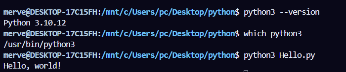
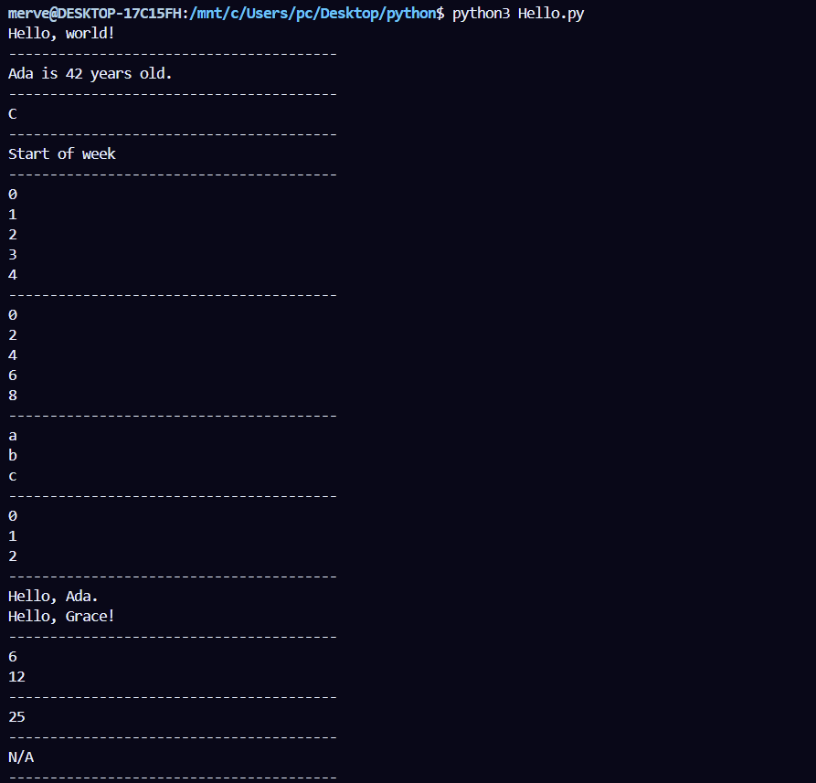
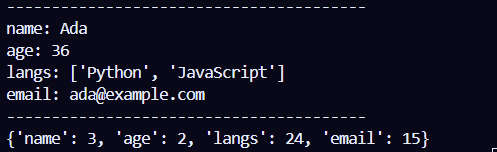

# Branch: `01_Hello`

This branch introduces the fundamentals of Python programming. It includes examples covering basic syntax, variables, control flow, loops, functions, and common data structures.

## Topics Covered

* Printing output (`print`)
* Variables and basic data types
* String formatting with f-strings
* Multiple assignment and variable swapping
* Conditional statements (`if`, `elif`, `else`)
* Pattern matching (`match` / `case`)
* `for` and `while` loops
* List comprehensions
* Functions
* Lambda expressions
* Dictionaries, lists, tuples, and sets
* Dictionary comprehensions

## Running the Example

Ensure Python 3 is installed, then run:

```bash 
python3 Hello.py
```

## Example Output

The following screenshots show the output produced by the example program.

### Output 1



### Output 2



### Output 3


