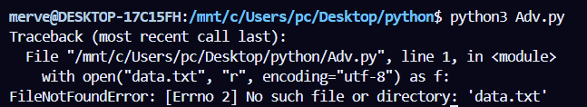
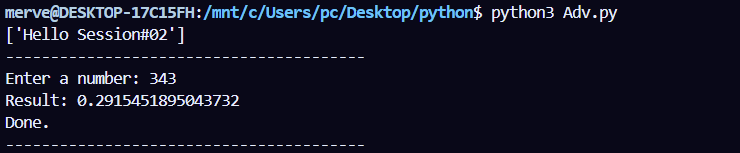
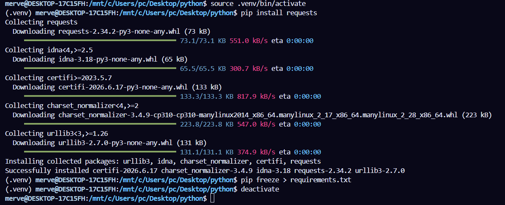

# Branch: `02_Advanced`

This branch builds on the concepts introduced in **`01_Hello`** and demonstrates more practical Python features that are commonly used in real-world applications.

## Topics Covered

* File handling
* Exception handling
* Modules and imports
* Command-Line Interfaces (CLI)
* Virtual environments (`venv`)

---

# Project Structure

```text
02_Advanced_Basics/
│
├── 01_file_io.py
├── 02_exceptions.py
├── 03_modules.py
├── 03_utils.py
├── 04_cli.py
│
├── data.txt
├── data.json
├── data.csv
├── out.txt
│
└── README.md
```

## Running the Examples

Run each example individually:

```bash
python3 01_file_io.py
python3 02_exceptions.py
python3 03_modules.py
python3 04_cli.py <image_path> --width 800 --verbose
```

---

# 1. Working with Files

The `01_file_io.py` example demonstrates how to:

* Read a text file
* Write to a text file
* Read JSON files
* Read CSV files

## Reading a Text File

If `data.txt` does not exist, Python raises a `FileNotFoundError`.

Example:



> **Note**
>
> The screenshots in this README were captured before the project was reorganized. At the time, the main example file was named **`adv.py`**. Although the screenshots reference `adv.py`, the examples have since been split into separate files (such as `01_file_io.py`, `02_exceptions.py`, `03_modules.py`, and `04_cli.py`) to make the project easier to follow. The functionality shown in the screenshots remains the same.

To fix the error:

1. Create a file named `data.txt`.
2. Add some sample text.
3. Run the program again.

> **Note**
>
> This behavior only occurs when opening a file in **read** mode (`"r"`).
> Opening a file in **write** mode (`"w"`) automatically creates the file if it does not already exist.

---

## JSON Example

Create a file named:

```text
data.json
```

Add the following content:

```json
{}
```

The example uses Python's built-in `json` module to read the file.

---

## CSV Example

Create a file named:

```text
data.csv
```

Example content:

```csv
name,age
Ada,36
Grace,40
```

The example reads the file using `csv.DictReader`.

---

# 2. Exception Handling

The `02_exceptions.py` example demonstrates:

* `try`
* `except`
* `else`
* `finally`
* Raising your own exceptions using `raise`

Example output:



Use the following command instead of adv.py  
```
 python3 02_exeptions.py
```

---

# 3. Modules and Imports

The `03_modules.py` example demonstrates:

* Importing your own modules
* Importing from Python's Standard Library
* Using the `math` module
* Using the `__name__ == "__main__"` pattern

The custom module `utils.py` contains the reusable `slugify()` function, which is imported into `03_modules.py`.

---

# 4. Command-Line Interface (CLI)

The `04_cli.py` example demonstrates how to build a simple command-line application using Python's `argparse` module.

Example:

```bash
python3 04_cli.py image.jpg --width 500 --verbose
```

The screenshots below show the original image and the resized output.


Use the following command instead of resize.py
 ```
    python3 04_cli.py
  ```
---

# 5. Virtual Environments

A virtual environment isolates your project's dependencies from other Python projects installed on your machine.

## Create a virtual environment

```bash
python3 -m venv .venv
```

## Activate the environment

### macOS / Linux

```bash
source .venv/bin/activate
```

### Windows (Command Prompt)

```cmd
.venv\Scripts\activate
```

### Windows (PowerShell)

```powershell
.venv\Scripts\Activate.ps1
```

## Install packages

```bash
pip install requests
```

## Save installed dependencies

```bash
pip freeze > requirements.txt
```

## Reinstall dependencies

```bash
pip install -r requirements.txt
```

## Leave the virtual environment

```bash
deactivate
```

Example:


